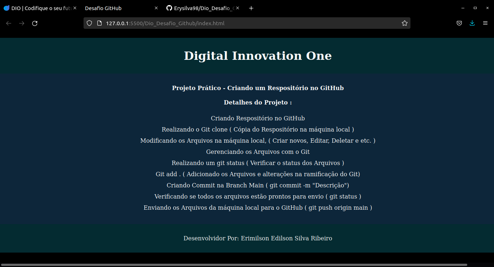

# DIO-Desafio_Github

#
## Tela Inicial
#

#

Aula prática do Bootcamp na Dio: Inter Frontend Developer

    - Criando o Repositório no GitHub

---

Objetivo do Projeto:

    - Desenvolver os conhecimentos em Git e Github
    - Criando o Repositório e Gerenciando os arquivos
    - Repositório para futuros códigos e atividades.
---

Implementações :
    
    - Criado um arquivo Html contendo a Descrição das atividades realizadas 
    - Criado um arquivo css para estilização
    - Imagen da Website anexada.
---

